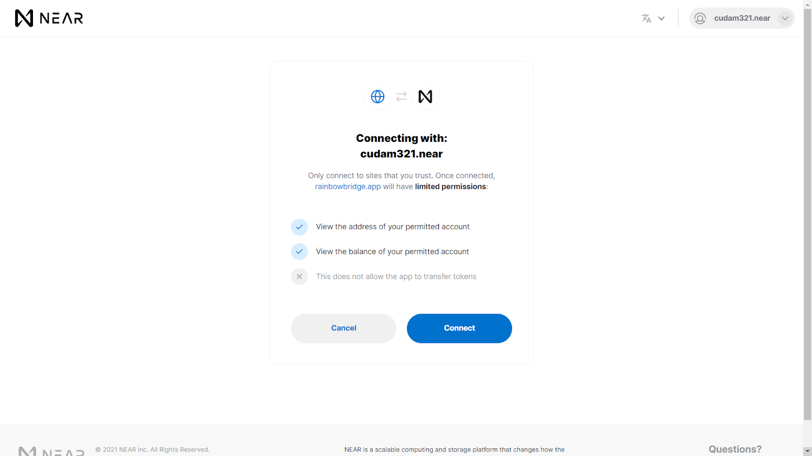

# Bridging Guides

The [Rainbow Bridge](https://rainbowbridge.app/transfer) is the way to transfer your assets back and forth between Ethereum & NEAR & Aurora. This guide will show you how to use it.

## Ethereum <> Aurora using the Rainbow Bridge

### From Ethereum to Aurora

1. Go to http://rainbowbridge.app/ and connect your Metamask  

2. Choose the route from Ethereum to Aurora. You can also choose to send to an address other than yours.
 

3. Choose your asset and the amount that you want to transfer then click **Continue**
 

4. **Confirm** the Transfer
 

5. Confirm again in your Metamask, once you confirmed, the transfer will start.
 

6. All you need to do now is sit back and relax until the transfer is completed. Transfers from Ethereum to Aurora take about 10 minutes.
 

7. Now when both sides are finalized, your transfer will be listed as Completed Transfers. And now you can enjoy using DeFi on one of the fastest and most decentralized blockchains.
 

### From Aurora to Ethereum

The transfer process from Aurora to Ethereum should be the same as Ethereum to Aurora, the only difference is it takes roughly 16 hours and with a more expensive fee. However before transfering the app will calculate the estimated fees for you.
 

## NEAR <> Aurora Bridge using the Rainbow Bridge

### From Near to Aurora

1. Go to http://rainbowbridge.app/ and connect your Metamask wallet & Near Wallet
 

*Connect* your Near wallet
 

2. Choose the route from NEAR to Aurora. You can also choose to send to an address other than yours.
 

3. Choose your asset and the amount that you want to transfer, hit **Continue** then **Confirm**.
Note: Transfers between Aurora and NEAR are very low cost, *typically a few cents*. The fees will be charged from your Near wallet
 

4. You’ll be redirected to your Near Wallet to confirm the transaction. Hit **Allow**
 

5. Transfers between Near & Aurora are instantaneous. After the transaction, you’ll be redirected back to Rainbow Bridge and see your transfer is listed as **Completed**

    *Add the token you just transferred to Metamask as below*
     

### From Aurora to Near

1. Choose the route from Aurora to Near. You can also choose to send to an address other than yours.
     

2. Choose your asset and the amount that you want to transfer, hit **Continue** then **Confirm**.
     

3. Confirm the transaction in your Metamask
     

4. Transfers between Aurora & Near are instantaneous. After confirmed the transaction in your Metamask, you’ll see your transfer is listed as **Completed**
     

