# Exchange

The exchange is where you can trade one token for another. It is a simple swap interface, just select the two tokens you wish to exchange.
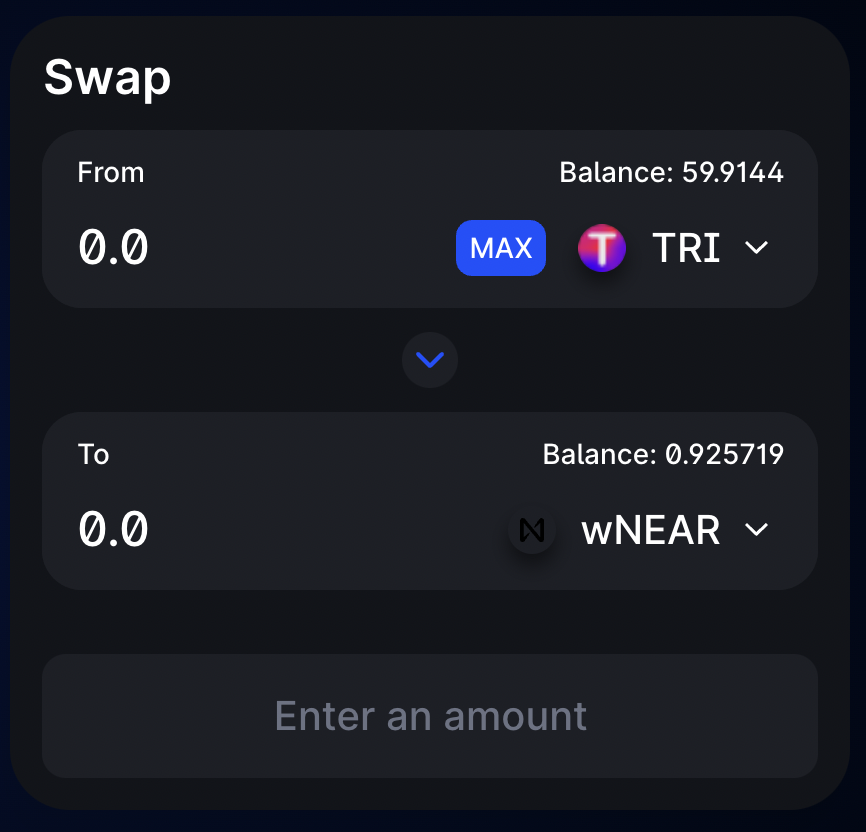

The liquidity provided to the exchange comes from Liquidity Providers ("LPs") who stake their tokens in "Pools". In exchange, they get LP (Liquidity Provider) tokens, which can also be staked to earn TRI tokens in the "farms".

When you make a token swap (trade) on the exchange you will pay a 0.3% trading fee, which is broken down as follows:
- 0.25% - Paid to liquidity pools in the form of a trading fee for liquidity providers.
- 0.05% - Sent to TRI token farm. (See [Staking](https://trisolaris-labs.github.io/docs/Staking/) for more details)

## Swap

How to swap tokens on Trisolaris

1. Go to **Swap** page 
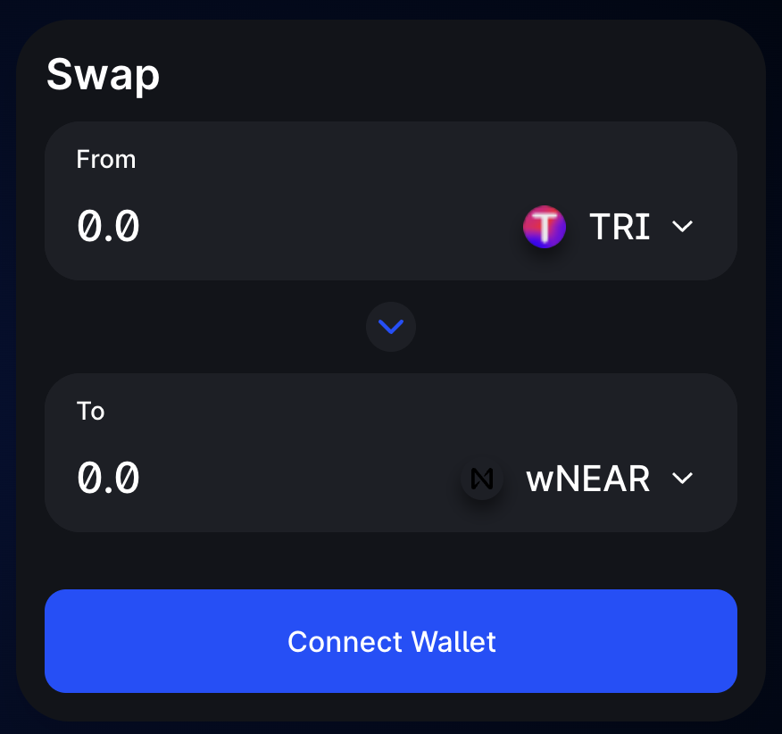 

2. Unlock your Aurora Wallet. (You can find it in the top right side of the screen)
 

3. Select the tokens you would like to trade and enter the amounts.
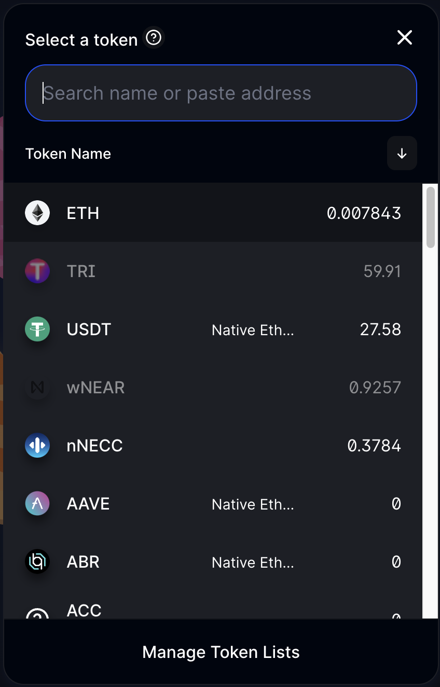  

4. Check your details and click **Swap**
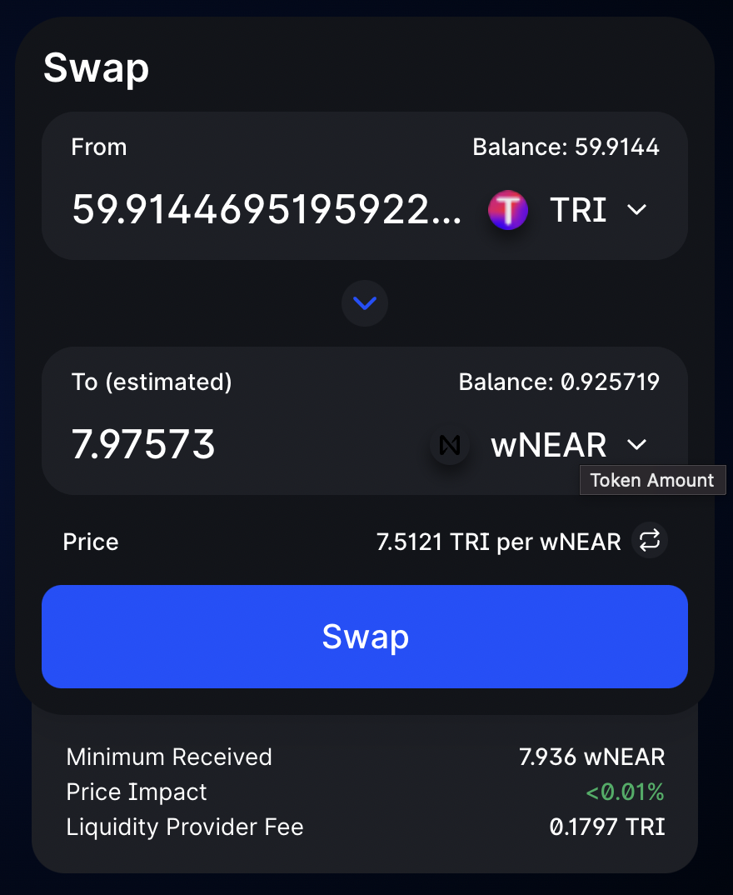 

5. You'll see a popup asking you to confirm details. Click **Confirm Swap**. You may need to click **Approve** first. (This is to approve Trisolaris to execute the trade for you.)
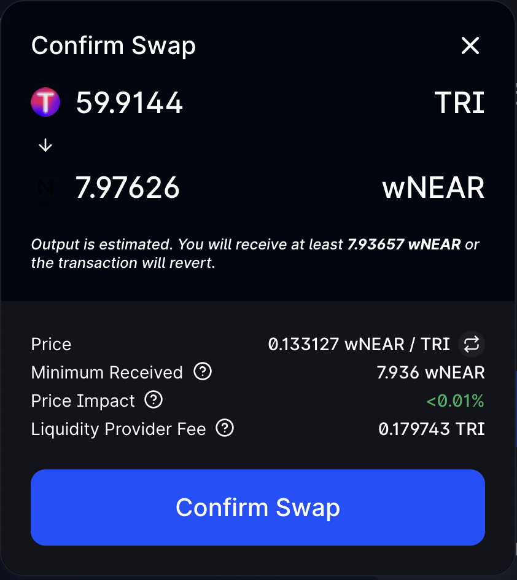 

6. Confirm the transaction in your wallet.
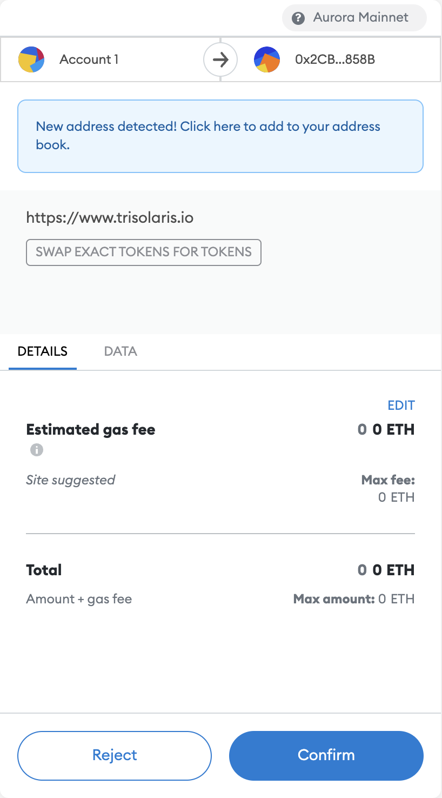 

7. Done! you can view the transaction in Aurora Explorer.
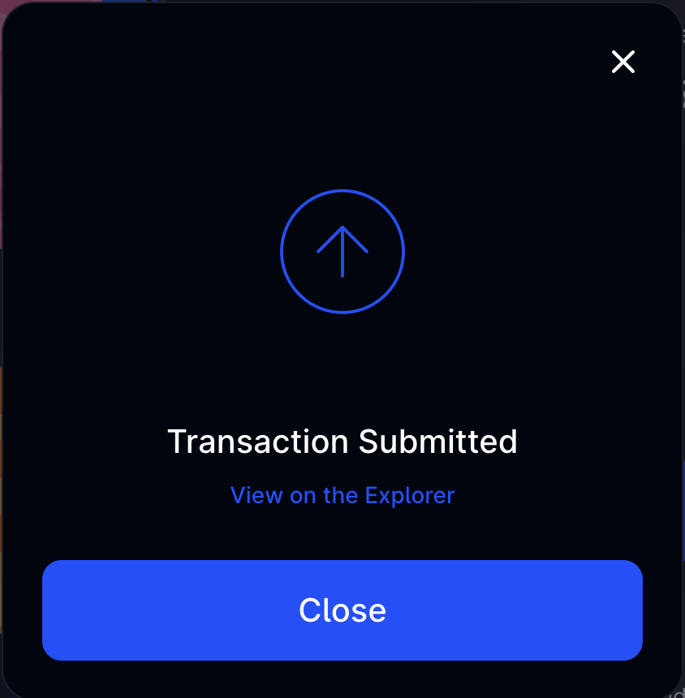 

## Liquidity Pools

Trisolaris charges 0.3% fee for all trades, of which **0.25%** is added to the liquidity pool of the token pair that was traded on. 
A **liquidity pool** (LP) is a pool of two tokens, e.g. NEAR and TRI tokens. This pool is what allows users to exchange between the two tokens automatically.
Users can earn a share of the trading fees by depositing a pair of tokens into the LP (also known as "adding liquidity"). Users will receive an LP token, representing their share of the LP. 

### Risks and Rewards

By adding liquidity you'll earn **0.25%** of all trades on this pair proportional to your share of the pool. Fees are added to the pool, accrue in real time and can be claimed by withdrawing your liquidity.

*Your share of the Trading Fees will be accrued in real time and will be paid on top of your existing position when you exit the Liquidity Pool*

Providing liquidity is not without risk, as you may be exposed to impermanent loss (IL).

If the prices of the two tokens revert back to the same prices when you added liquidity, you won't suffer any IL.

### How to add Liquidity to a Pool?

1. Grab your tokens and head to the **Pools** page.
 

2. Choose **Add liquidity**
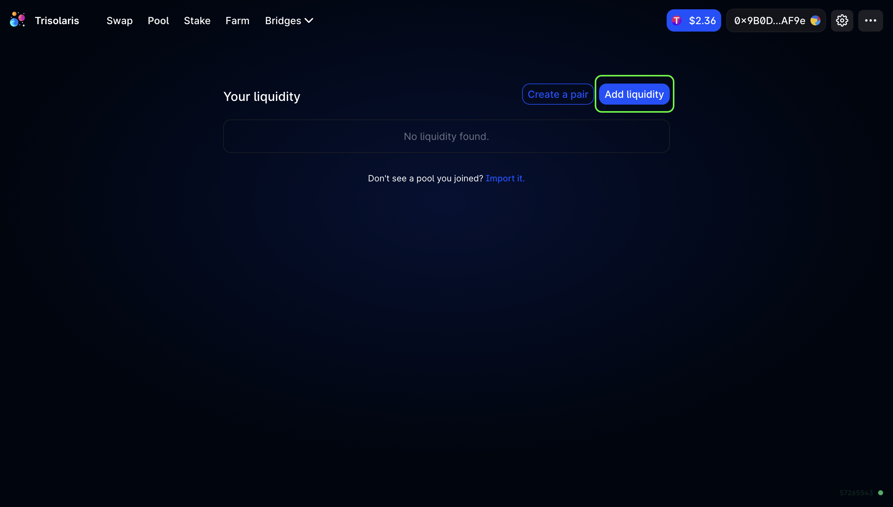 

3. Select 2 tokens that you wish to provide liquidity to, enter in the amount of tokens.
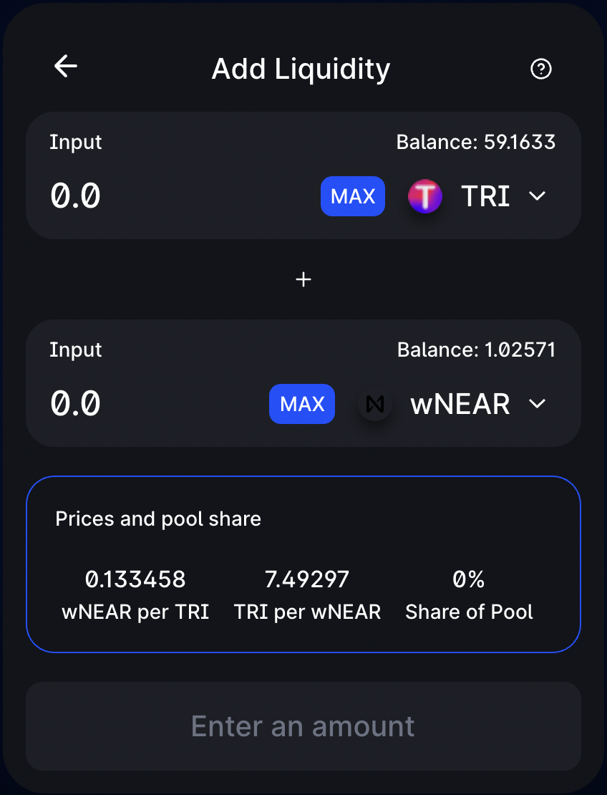  

4. Once you add in the tokens, hit **Supply**
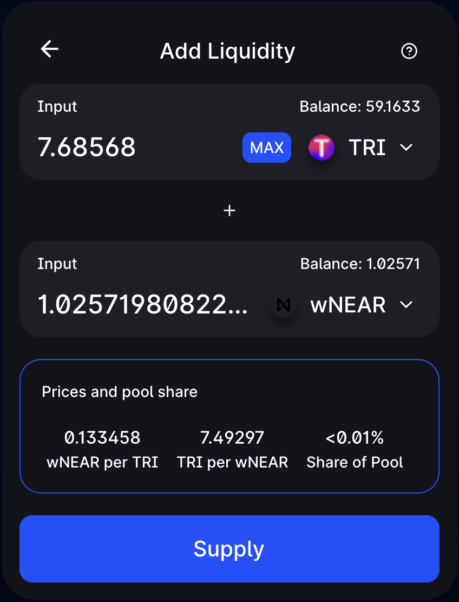 

5. **Confirm Suppy**
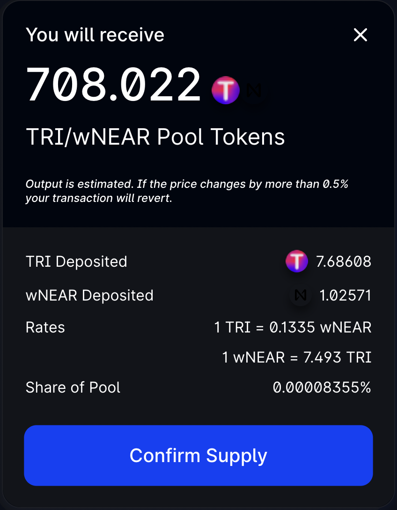 

6. **Approve** in your Metamask and done! You are now earning your share of Trading Fees generated by the Pool!
 

*In return for depositing tokens to a Pool, you will receive an amount of '**TLP Tokens**', you might be able to use these Tokens in one of our Farms to earn extra yield (on top of the Trading Fees) in the form of $TRI Tokens.*

### How to Remove Liquidity from a Pool?

1. Go to pools, choose to **Manage** the pool you want to remove liquidity.

*Can’t see your LP Tokens? **Import it**. Also make sure to withdraw them from farms first before removing liquidity.*
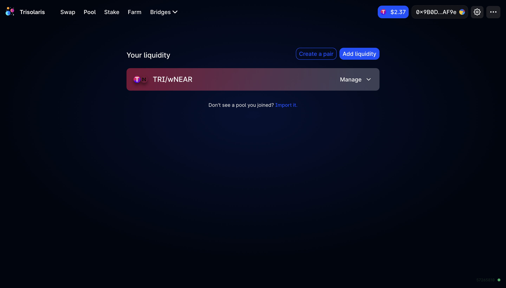 

2. Click **Remove**
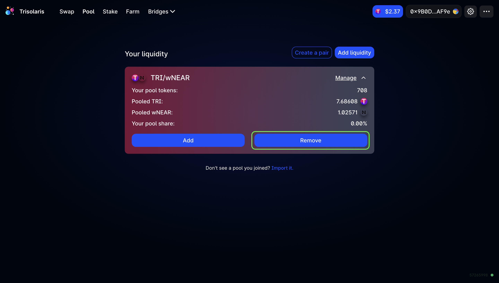 

3. Adjust the amount you want to remove, click **Approve**, confirm the transaction in your Metamask, then hit **Remove**.
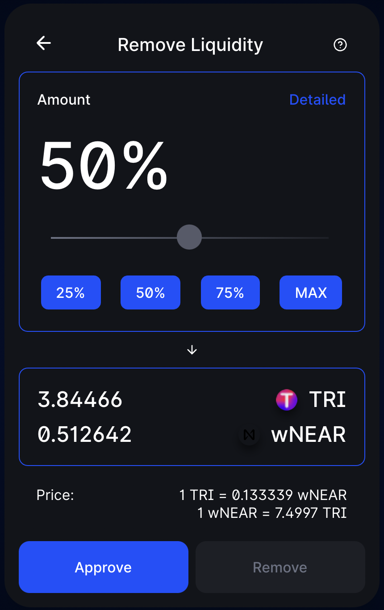 

4.  Confirm the transaction in your Metamask and you’re done!
 
