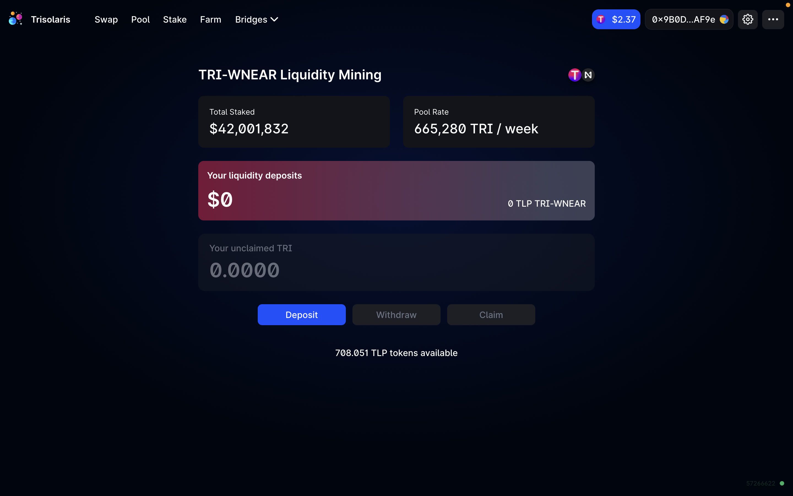
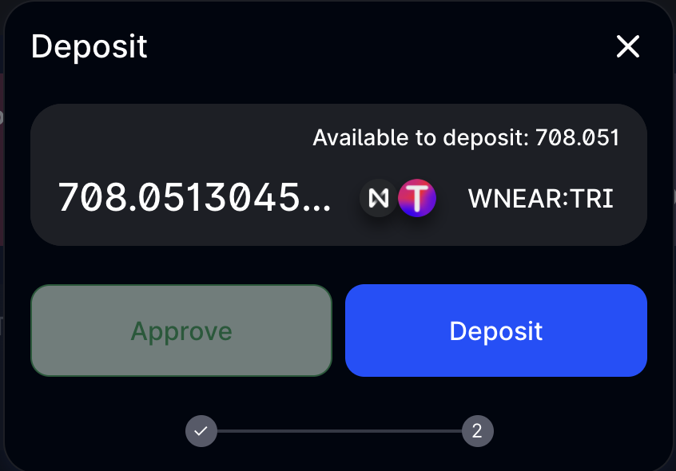
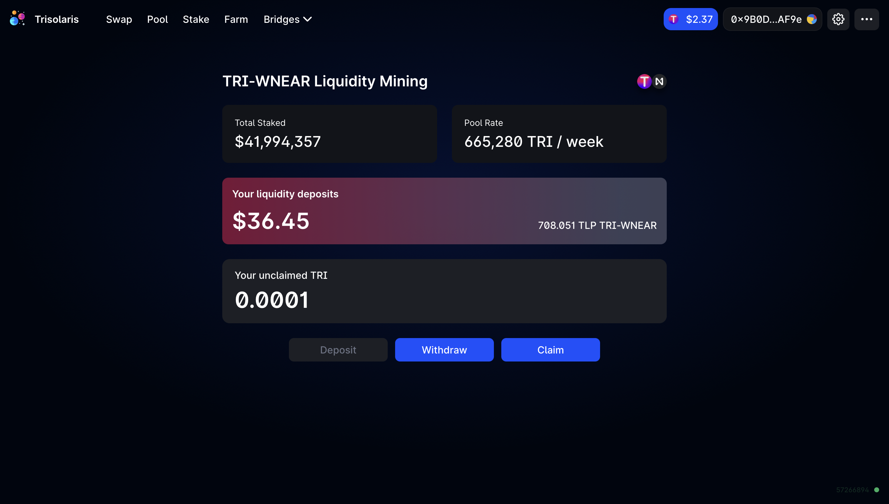

# Yield Farm

## Why Yield Farm?

- Deposit your Liquidity Pool tokens into a farm to earn extra yield
- Extra yield is rewarded in $TRI Tokens

## How to earn TRI token rewards through yield farming

1. [Provide liquidity to a pair](https://trisolaris-labs.github.io/docs/Exchange/#How-to-add-Liquidity-to-a-Pool?) (e.g NEAR + TRI)

2. Go to the Farm page and select the same Farm you entered in the pool (NEAR+ TRI), hit **Deposit**
 

3. You are now viewing the Farm statistics page. This contains the Farm details including Liquidity, Pool Weight & APR. 

Enter the amount of LP tokens you wish to deposit, then hit **Deposit**

4. Hit **Approve**, then confirm the transaction in your Metamask.

After that, continue to hit **Deposit**, confirm the transaction in your Metamask again

5. Congratulations, you are now earning $TRI rewards from the Farm!

## How to Harvest Rewards + Unstake

1. TRI rewards are updated every few seconds.
2. To receive your TRI token rewards, select the **Claim** button.
3. To Unstake your LP Tokens, select **Withdraw**.

