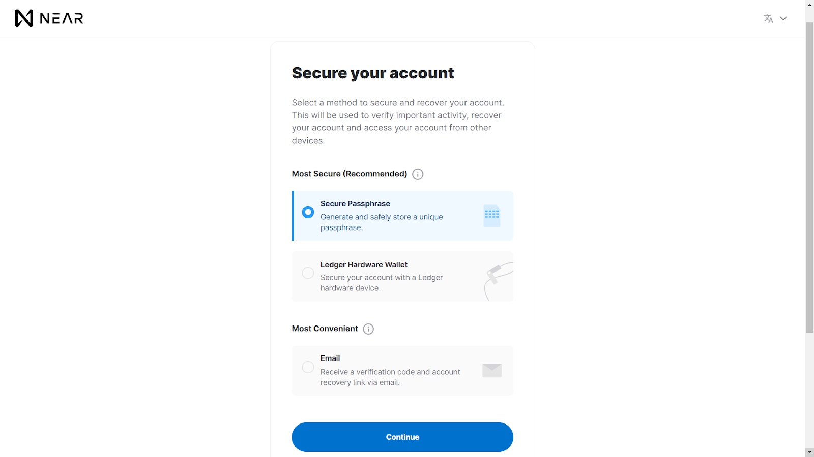
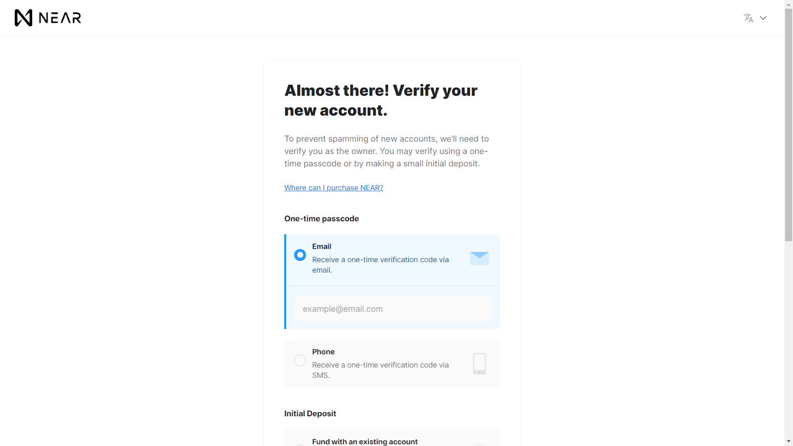
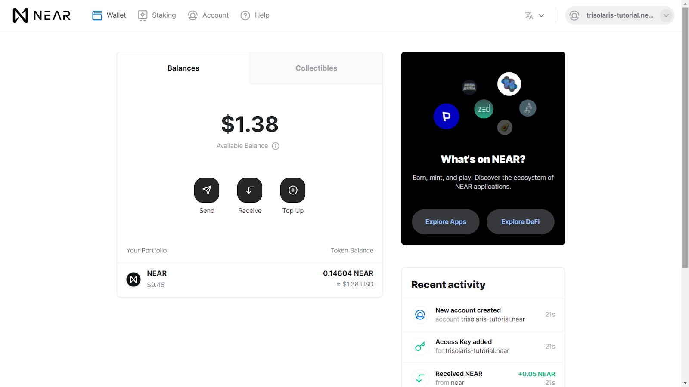

# Getting Started

Trisolaris is #1 Dex on the Aurora engine, an EVM compatible blockchain running in the NEAR ecosystem. This user guide will provide an overview of how to use Trisolaris.

## Set up Metamask with Aurora mainnet

### Installing Metamask

If you have not installed and own a Metamask wallet, please do so [here](https://metamask.io/). It is compatible with Chrome, Brave and Firefox.

### Connect Metamask to Aurora

Unlock Metamask > Select Settings > Select Add Network.
Enter the following Aurora information:

* Network Name: Aurora Mainnet
* New RPC URL: https://mainnet.aurora.dev
* ChainID: 1313161554
* Symbol: AETH
* Explorer: https://explorer.aurora.dev/
* Gas fees on Aurora will be paid in ETH, making users from Ethereum feel at home.

## Set up a NEAR Wallet

### How to create a NEAR web wallet
Near wallet is your gateway to send NEAR from a CEX (centralized exchange) to another wallet which is connected to Aurora network. This guide will show you how to create your own Near wallet. If you already have one, skip this part.

1. Go to wallet.near.org. Choose “Create Account”
 

2. This is the place where you can choose your own name account, try to make a good one since you can not change that name after you finish. Some rules that you should follow:
    * Note: This will also be your wallet address, unlike the cryptographic wallet addresses common to Ethereum, NEAR uses human-readable account names as wallet addresses.
 

    * Your account ID can contain any of the following:
        * Lowercase characters (a-z)｜Digits (0–9)｜Characters (_-) can be used as separators
    * Your account ID CANNOT contain:
        * Characters “@” or “.”｜Fewer than 2 characters｜More than 64 characters (including .near)

3. Choosing your security method. This one is important as you need to choose your secured method. Luckily, you can change this after you create an account, but right now you should select the most secure (i.e: Recovery Phrase or Ledger Nano S or X). You can add two other methods after you finish creating an account.
 

4. Now your screen will present twelve characters and you have to back up this phrase. You can do the following action to backup:
    * Write down several pieces of paper and put them somewhere else safe.
    * Save it into some files on another computer or phone which you only use for security purposes (remember to clean all the virus before putting the seed phrase into it).
     

5. Make sure you get your seed phrase secure and then you enter one of the random keywords (in this situation is word number 5) to verify that phrase.
     

6. Now you'll need to verify your new account, there are 2 ways to do this:

    * One-time passcode: Verify your account by confirming the passcode sent via email or phone SMS.
    *  Initial Deposit: Verify your account by making your first deposit. This can be done by depositing from an existing account, purchasing with a Credit Card (via Moonpay) or by making a manual deposit from CEXs.
         

7. You're all done! You have successfully created your Near Account and the screen should be like this.
         

