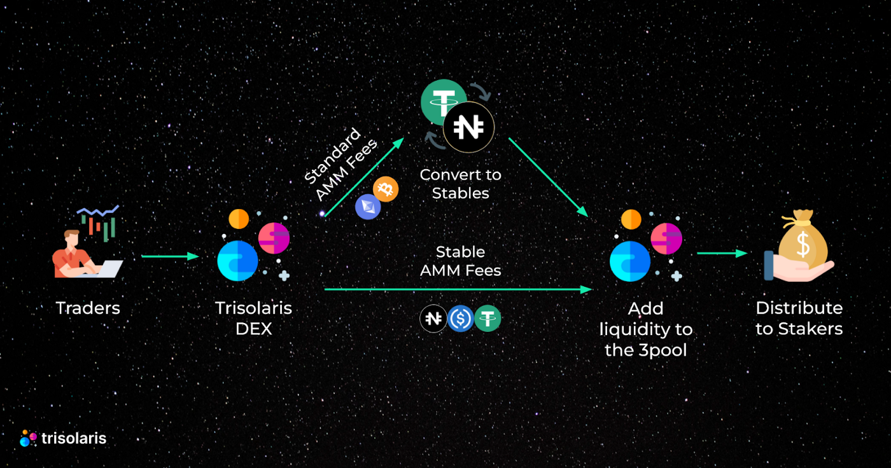
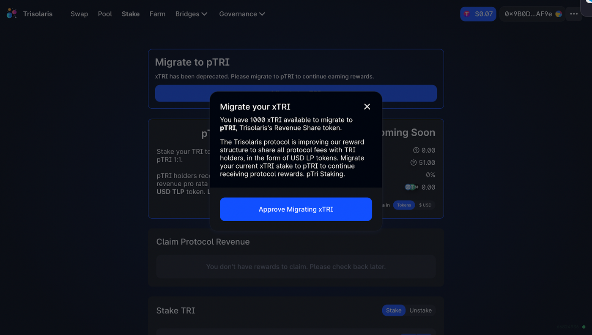
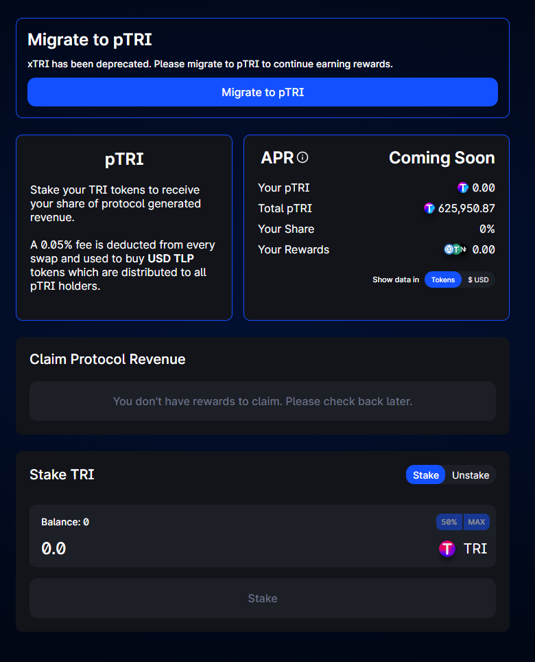

# Staking

## Stake your TRI to pTRI to earn 0.05% of protocol revenue in the form of stablecoin LP tokens!

All revenue collected by Trisolaris DEX will be converted into USN, USDT & USDC, these stables will then be added to the existing 3pool to get LP tokens back, and eventually will be distributed to stakers based on their proportion in the staking pool! Users will have a choice to claim them, or claim + auto-stake into the 3pool farm!

### Contracts and how does it work?

* pTRI: [0xe559092D2e80d9B1d91a641CE25bACC3cFdCF689](https://aurorascan.dev/address/0xe559092D2e80d9B1d91a641CE25bACC3cFdCF689)
* USDCMaker: [0x5EBd5e963A00500B6a1234c621811c52AF0aAade](https://aurorascan.dev/address/0x5EBd5e963A00500B6a1234c621811c52AF0aAade)
* StableLPMaker: [0xcB251907382aEB3C2edAb766561D5F4E6c78E3FF](https://aurorascan.dev/address/0xcB251907382aEB3C2edAb766561D5F4E6c78E3FF)
* LpToken: [0x87BCC091d0A7F9352728100268Ac8D25729113bB](https://aurorascan.dev/address/0x87BCC091d0A7F9352728100268Ac8D25729113bB)
* DAO: [0xf86119de6ee8d4447C8219eEC20E7561d09816d3](https://aurorascan.dev/address/0xf86119de6ee8d4447C8219eEC20E7561d09816d3)

1- The USDCMaker - converts normal AMM fees to USDC

2- USDC is sent to the stableLPMaker

3- Combines with the stableswap fees

4- Converts to stableswap LP

5- Sends to pTRI as rewards

### How to migrate from xTRI to pTRI?

Step 1: Head to https://www.trisolaris.io/ and go to the Stake page.

Step 2: Here there will be a form shows up and ask you to migrate your xTRI to pTRI. Once you’ve Approved & hit Migrate, the protocol will then automatically unstake the xTRI for TRI, then stake those TRI into pTRI.

### How to Stake

- Navigate to the the **Stake** section:

- Enter the amount you want to stake then hit **Approve** & Confirm in your Metamask.

- After that hit **Stake** & Confirm in your Metamask again.

- You will receive pTRI tokens in your wallet. In the central panel you will see your ‘**pTRI Balance**’

### How to unstake

- Simply select **Unstake**

- Enter the amount you wish to unstake in the balance input and select **Approve** & Confirm in your Metamask.

- After that hit **Stake** & Confirm in your Metamask again.

- You will receive your original staked TRI tokens, plus your share of TRI token rewards from fees.
