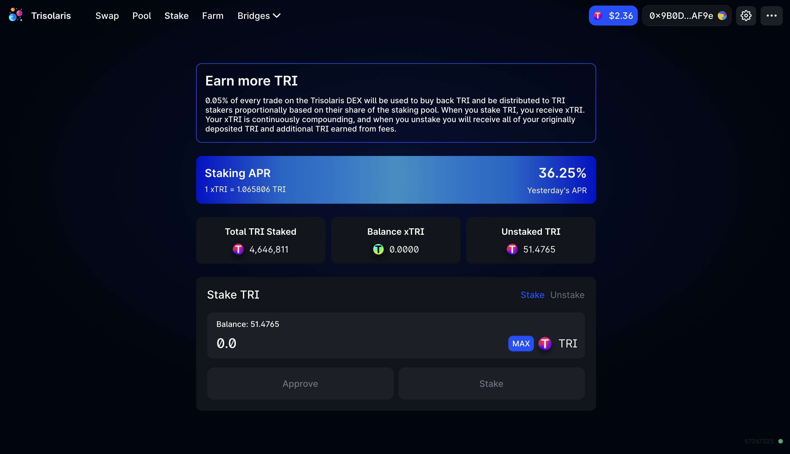

# Staking

## Stake your TRI to xTRI to maximize your yield 

### Why is Staking better than Auto-compounders?

Auto-compounders sell your TRI rewards from yield farming to increase your LP positions. If you're farming with NEAR-USDT, for example, you can gain more NEAR-USDT. It's attractive because the yields can appear big, but it minimizes your TRI tokens. This means that you miss out on profits if TRI tokens increase price. 

Instead, you may stake your TRI tokens to xTRI, which has no impermanent loss (IL), and maximizes your profits when TRI tokens go up. 

### How does it work?

xTRI is the main staking mechanism on the Trisolaris Protocol. When you stake your TRI, you effectively exchange your TRI for xTRI. Over time, you’ll always earn more TRI by holding xTRI tokens.

This is because every swap on Trisolaris, a 0.05% fee is charged and sent to the xTRI pool. This fee is used to buy back TRI tokens periodically (currently, buy-backs happen every 1 days). So when you exchange your xTRI for TRI, you'll get more TRI than what you started with.

### Why stake?

- No Impermanent Loss
- Maximize your profits when TRI tokens go up
- A 0.05% trading fee is used to periodically buy back TRI tokens. When you exchange your xTRI for TRI, you'll receive more TRI than you started with.

### How to Stake

- Navigate to the the **Stake** section:

- Enter the amount you want to stake then hit **Approve** & Confirm in your Metamask.

- After that hit **Stake** & Confirm in your Metamask again.

- You will receive xTRI tokens in your wallet. In the central panel you will see your ‘**xTRI Balance**’

### How to unstake

- Simply select **Unstake**

- Enter the amount you wish to unstake in the balance input and select **Approve** & Confirm in your Metamask.

- After that hit **Stake** & Confirm in your Metamask again.

- You will receive your original staked TRI tokens, plus your share of TRI token rewards from fees.

